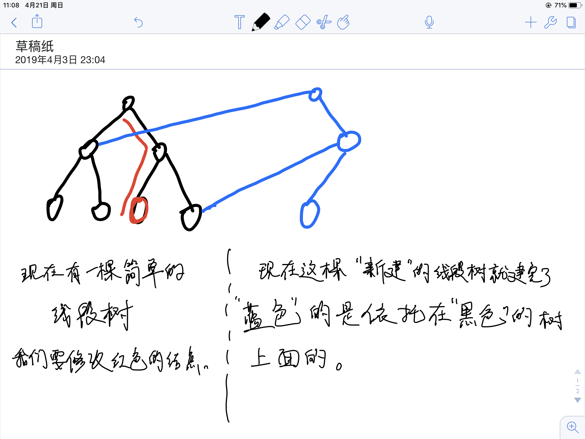

# 主席树(附2019ICPC南昌邀请赛网络赛J题题解)

主席树就是可持久化线段树。

什么叫可持久化呢, 大家顾名思义就可以了。

我们还是具体关注一下怎么可持久化。

可持久化嘛，很显然，我们对每一个点建一棵线段树就行了。但是这么做，时间和空间复杂度都不可行。

现在有一棵线段树：




```c++
// luogu-judger-enable-o2
#include <bits/stdc++.h>
using namespace std;
const int maxn = 2e5+7;
int a[maxn],root[maxn],n,m,cnt,x,y,k;
vector<int> v;
struct node
{
	int l;
	int r;
	int sum;
}T[maxn*50];
int getid(int x)
{
	return lower_bound(v.begin(),v.end(),x)-v.begin()+1; 
}
void update(int l,int r,int &x,int y,int pos)
{
	T[++cnt] = T[y];
	T[cnt].sum++;
	x = cnt;
	if(l==r) return;
	int mid = (l+r)/2;
	if(pos<=mid)
	{
		update(l,mid,T[x].l,T[y].l,pos);
	}
	else 
	{
		update(mid+1,r,T[x].r,T[y].r,pos);
	}
}
int query(int l,int r,int x,int y,int k)
{
	if(l==r) return l;
	int mid = (l+r)/2;
	int s = T[T[y].l].sum-T[T[x].l].sum;
	if(k<=s)
	{
		return query(l,mid,T[x].l,T[y].l,k);
	}
	else 
	{
		return query(mid+1,r,T[x].r,T[y].r,k-s);
	}
}
int main()
{
	scanf("%d%d",&n,&m);
	for(int i=1;i<=n;i++)
	{
		scanf("%d",a+i);
		v.push_back(a[i]);
	}
	sort(v.begin(),v.end());
	v.erase(unique(v.begin(),v.end()),v.end());
	for(int i=1;i<=n;i++)
	{
		update(1,n,root[i],root[i-1],getid(a[i]));
	}
	for(int i=1;i<=m;i++)
	{
		scanf("%d%d%d",&x,&y,&k);
		printf("%d\n",v[query(1,n,root[x-1],root[y],k)-1]);
	}
	return 0;
}

```


```c++
#include <bits/stdc++.h>
using namespace std;
const int maxn = 1e5+7;
int n,m,a[maxn],root[maxn],cnt,x,y,k;
vector<int> v;
struct node
{
	int l;
	int r;
	int sum;
}T[maxn*50];
int getid(int x)
{
	return lower_bound(v.begin(),v.end(),x)-v.begin()+1;
}
void update(int l,int r,int &x,int y,int pos)
{
	T[++cnt] = T[y];
	T[cnt].sum++;
	x = cnt;
	if(l==r) return;
	int mid = (l+r)/2;
	if(pos<=mid) update(l,mid,T[x].l,T[y].l,pos);
	else update(mid+1,r,T[x].r,T[y].r,pos);
}
int query(int l,int r,int x,int y,int k)
{
	if(r<=k) return T[y].sum-T[x].sum;
	int mid = (l+r)/2;
	if(k<=mid) return query(l,mid,T[x].l,T[y].l,k);
	else 
	{
		return T[T[y].l].sum-T[T[x].l].sum+query(mid+1,r,T[x].r,T[y].r,k);
	}
}
int main()
{
	int T;
	scanf("%d",&T);
	for(int t=1;t<=T;t++)
	{
		v.clear();
		printf("Case %d:\n",t);
		scanf("%d%d",&n,&m);
		for(int i=1;i<=n;i++) 
		{
			scanf("%d",a+i);
			v.push_back(a[i]);
		}
		sort(v.begin(),v.end());
		v.erase(unique(v.begin(),v.end()),v.end());
		for(int i=1;i<=n;i++) update(1,n,root[i],root[i-1],getid(a[i]));
		for(int i=1;i<=m;i++)
		{
			scanf("%d%d%d",&x,&y,&k);
			x++,y++;
			int h = upper_bound(v.begin(),v.end(),k)-v.begin();
			if(h) printf("%d\n",query(1,n,root[x-1],root[y],h));
			else printf("0\n");
		}
	}	
	return 0;
}

```


做完了上面那个题，这个题应该可以很快AC的鸭！

[2019ICPC南昌邀请赛网络赛J题](<https://nanti.jisuanke.com/t/38229>)

这题题目就是树形的上一题，题目给定u,v，所以我们就query(1,u)+query(1,v)-2*query(1,lca(u,v))就行啦！

lca的dfs的时候我们就可以把主席树建好了。详见代码：

```c++
#include <bits/stdc++.h>
using namespace std;
const int maxn = 1e5+7;
struct node
{
	int l;
	int r;
	int sum;
}T[maxn*50];
struct edge
{
	int to;
	int w;
};
int n,m,cnt,root[maxn],x,y,w,k,lg[maxn],fa[maxn][21],dep[maxn],vis[maxn];
vector<int> v;
vector<edge> G[maxn];
int getid(int x)
{
	return lower_bound(v.begin(),v.end(),x)-v.begin()+1;
}
void update(int l,int r,int &x,int y,int pos)
{
	T[++cnt] = T[y];
	T[cnt].sum++;
	x = cnt;
	if(l==r) return;
	int mid = (l+r)/2;
	if(pos<=mid) update(l,mid,T[x].l,T[y].l,pos);
	else update(mid+1,r,T[x].r,T[y].r,pos);
}
int query(int l,int r,int x,int y,int k)
{
	if(r<=k) return T[y].sum-T[x].sum;
	int mid = (l+r)/2;
	if(k<=mid) return query(l,mid,T[x].l,T[y].l,k);
	else return T[T[y].l].sum-T[T[x].l].sum+query(mid+1,r,T[x].r,T[y].r,k);
}
void dfs(int now,int last)
{
	dep[now] = dep[last]+1;
	fa[now][0] = last;
	for(int i=1;(1<<i)<=dep[now];i++)
	{
		fa[now][i] =fa[fa[now][i-1]][i-1]; 
	} 
	for(int i=0;i<G[now].size();i++)
	{
		int t = G[now][i].to;
		if(t==last) continue;
		update(1,n,root[t],root[now],getid(G[now][i].w));
		dfs(t,now);
	}
}
int lca(int x,int y)
{
	if(dep[x]>dep[y]) swap(x,y);
	while(dep[x]!=dep[y])
	{
		if(lg[dep[y]-dep[x]]-1>=0) y = fa[y][lg[dep[y]-dep[x]]-1];
		else y = fa[y][0];
	}
	if(x==y) return x;
	for(int i=lg[dep[y]];i>=0;i--)
	{
		if(fa[x][i]!=fa[y][i])
		{
			x = fa[x][i];
			y = fa[y][i];
		}
	}
	return fa[x][0];
}
int main()
{
	scanf("%d%d",&n,&m);
	for(int i=1;i<=n;i++) lg[i] = lg[i-1]+(1<<lg[i-1]==i);
	for(int i=0;i<n-1;i++)
	{
		scanf("%d%d%d",&x,&y,&w);
		G[x].push_back({y,w});
		G[y].push_back({x,w});
		v.push_back(w);
	}
	sort(v.begin(),v.end());
	v.erase(unique(v.begin(),v.end()),v.end());
	dfs(1,0);
	for(int i=1;i<=m;i++)
	{
		scanf("%d%d%d",&x,&y,&k);
		int h = upper_bound(v.begin(),v.end(),k)-v.begin();
		if(h) printf("%d\n",query(1,n,root[1],root[x],h)+query(1,n,root[1],root[y],h)-2*query(1,n,root[1],root[lca(x,y)],h));
		else printf("0\n");
	}
	return 0;
}
```

