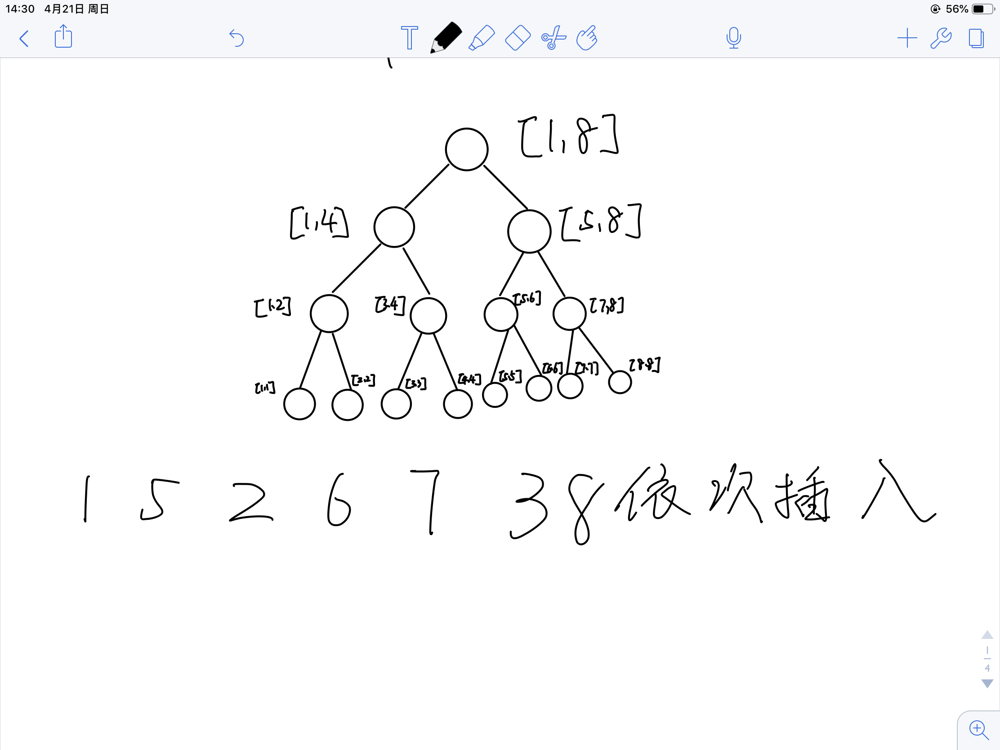
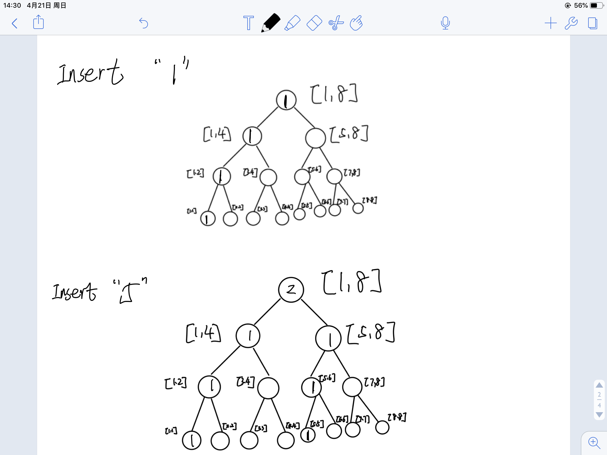
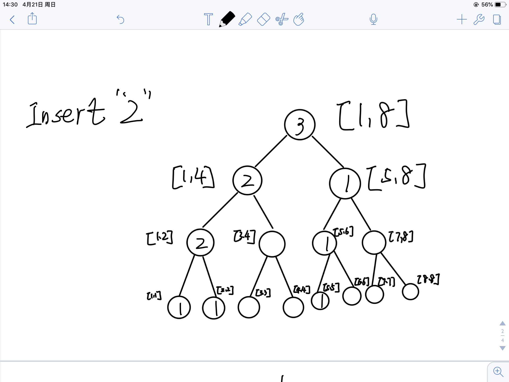
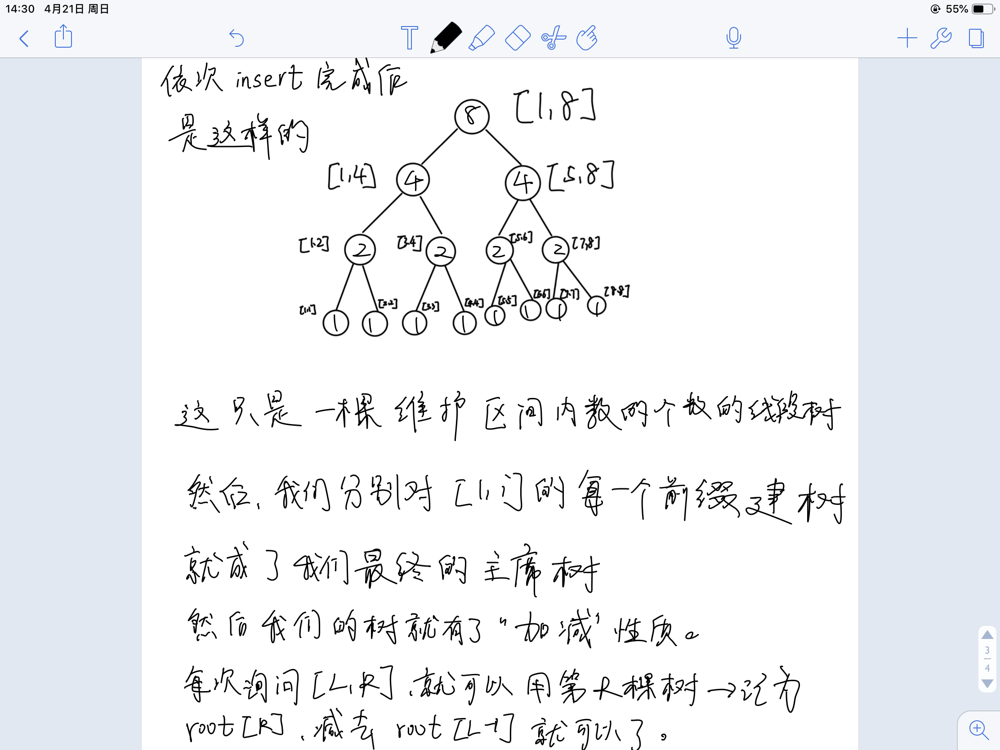
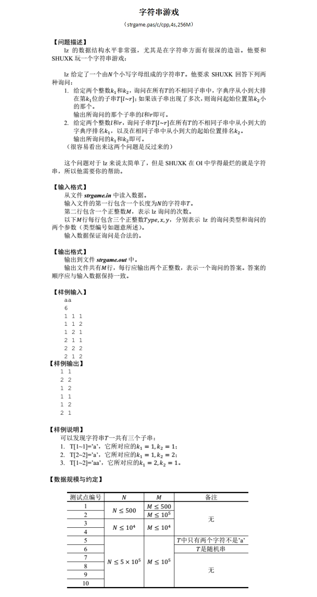

# 主席树(附2019ICPC南昌邀请赛网络赛J题题解)

主席树就是可持久化线段树。

什么叫可持久化呢, 大家顾名思义就可以了。

我们还是具体关注一下怎么可持久化。

可持久化嘛，很显然，我们对每一个点建一棵线段树就行了。但是这么做，时间和空间复杂度都不可行。

关于主席树，下面全都用图片的形式展现。


(我的字怎么会这么丑？？？)












相信大家对于主席树应该有了一定的了解了，下面我们来看一道题：

[洛谷可持久化线段树模板](<https://www.luogu.org/problemnew/show/P3834>)

没错，就是主席树的模板题。

上面我们建立好了主席树，现在我们来看如何询问区间。

***


**例题：**有一个序列，序列里面第k大的元素是多少。

首先我们需要序列有序，然后我们直接输出a[k]。现在我们不考虑这种做法。

我们用一种比较复杂的方法，有时候在某些问题上复杂，在另一些更复杂的问题上可能会变得简单。

现在我们依然需要序列是有序的，我们询问第k大的元素是多少，我们首先看另外一个问题：由于我们关注的是大小关系，一定意义上可以理解为，我们只需要关注序列的相对大小，与它自己本身是多大并没有关系。

比如 a:10000 100 100000 1 10

这个序列里面的第5大是第四个元素

​        b: 3 4 1 5 2

这个序列里面的第5大还是第四个元素。

b序列就是a序列的离散化序列。

现在我们回到如何找第k大元素的问题上：

现在序列是有序的，我们找第k大，如果k<=mid，说明第k大比中间的小，我们要找的肯定在左边。如果k>mid，说明第k大比中间的大，我们要找的肯定在右边。这样，我们就可以二分解决这个问题。

**具体怎么二分呢？**

如果k<=mid,我们就在[l,mid]找k

如果k>mid,我们就在[mid+1,r]找k-mid  (因为左边已经有了mid个，右边只需要找k-mid个)


***


上面的例题就说完了，现在我们已经离散化建好主席树了，那么区间询问的问题应该怎么解决呢？

我们对每一个前缀[1,i]建立一颗主席树，我们就可以通过询问query(r)-query(l-1)得到答案。

具体看代码吧。


```c++
// luogu-judger-enable-o2
#include <bits/stdc++.h>
using namespace std;
const int maxn = 2e5+7;
int a[maxn],root[maxn],n,m,cnt,x,y,k;
vector<int> v;
struct node
{
	int l;
	int r;
	int sum;
}T[maxn*50];
int getid(int x)
{
	return lower_bound(v.begin(),v.end(),x)-v.begin()+1; 
}
void update(int l,int r,int &x,int y,int pos)
{
	T[++cnt] = T[y];
	T[cnt].sum++;
	x = cnt;
	if(l==r) return;
	int mid = (l+r)/2;
	if(pos<=mid)
	{
		update(l,mid,T[x].l,T[y].l,pos);
	}
	else 
	{
		update(mid+1,r,T[x].r,T[y].r,pos);
	}
}
int query(int l,int r,int x,int y,int k)
{
	if(l==r) return l;
	int mid = (l+r)/2;
	int s = T[T[y].l].sum-T[T[x].l].sum;
	if(k<=s)
	{
		return query(l,mid,T[x].l,T[y].l,k);
	}
	else 
	{
		return query(mid+1,r,T[x].r,T[y].r,k-s);
	}
}
int main()
{
	scanf("%d%d",&n,&m);
	for(int i=1;i<=n;i++)
	{
		scanf("%d",a+i);
		v.push_back(a[i]);
	}
	sort(v.begin(),v.end());
	v.erase(unique(v.begin(),v.end()),v.end());
	for(int i=1;i<=n;i++)
	{
		update(1,n,root[i],root[i-1],getid(a[i]));
	}
	for(int i=1;i<=m;i++)
	{
		scanf("%d%d%d",&x,&y,&k);
		printf("%d\n",v[query(1,n,root[x-1],root[y],k)-1]);
	}
	return 0;
}

```


[HDU4417](<http://acm.hdu.edu.cn/showproblem.php?pid=4417>)

这个题目于上面的有一点不同，它是询问区间里面有多少个数<=k。

这个怎么做呢？

**分析：**

mid表示中间的数的大小，如果k<=mid，那么就说明k在左边，我们就继续往左边找。

如果k>mid，就说明k在右边，我们就要加上左边所有的部分然后往右边找。

具体看代码：


```c++
#include <bits/stdc++.h>
using namespace std;
const int maxn = 1e5+7;
int n,m,a[maxn],root[maxn],cnt,x,y,k;
vector<int> v;
struct node
{
	int l;
	int r;
	int sum;
}T[maxn*50];
int getid(int x)
{
	return lower_bound(v.begin(),v.end(),x)-v.begin()+1;
}
void update(int l,int r,int &x,int y,int pos)
{
	T[++cnt] = T[y];
	T[cnt].sum++;
	x = cnt;
	if(l==r) return;
	int mid = (l+r)/2;
	if(pos<=mid) update(l,mid,T[x].l,T[y].l,pos);
	else update(mid+1,r,T[x].r,T[y].r,pos);
}
int query(int l,int r,int x,int y,int k)
{
	if(r<=k) return T[y].sum-T[x].sum;
	int mid = (l+r)/2;
	if(k<=mid) return query(l,mid,T[x].l,T[y].l,k);
	else 
	{
		return T[T[y].l].sum-T[T[x].l].sum+query(mid+1,r,T[x].r,T[y].r,k);
	}
}
int main()
{
	int T;
	scanf("%d",&T);
	for(int t=1;t<=T;t++)
	{
		v.clear();
		printf("Case %d:\n",t);
		scanf("%d%d",&n,&m);
		for(int i=1;i<=n;i++) 
		{
			scanf("%d",a+i);
			v.push_back(a[i]);
		}
		sort(v.begin(),v.end());
		v.erase(unique(v.begin(),v.end()),v.end());
		for(int i=1;i<=n;i++) update(1,n,root[i],root[i-1],getid(a[i]));
		for(int i=1;i<=m;i++)
		{
			scanf("%d%d%d",&x,&y,&k);
			x++,y++;
			int h = upper_bound(v.begin(),v.end(),k)-v.begin();
			if(h) printf("%d\n",query(1,n,root[x-1],root[y],h));
			else printf("0\n");
		}
	}	
	return 0;
}

```


别急，下面还有一题！

[2019ICPC南昌邀请赛网络赛J题](<https://nanti.jisuanke.com/t/38229>)


做完了上面那个题，这个题应该可以很快AC的鸭！

这题题目就是树形的上一题，题目给定u,v，所以我们就query(1,u)+query(1,v)-2*query(1,lca(u,v))就行啦！

lca的dfs的时候我们就可以把主席树建好了。详见代码：

```c++
#include <bits/stdc++.h>
using namespace std;
const int maxn = 1e5+7;
struct node
{
	int l;
	int r;
	int sum;
}T[maxn*50];
struct edge
{
	int to;
	int w;
};
int n,m,cnt,root[maxn],x,y,w,k,lg[maxn],fa[maxn][21],dep[maxn],vis[maxn];
vector<int> v;
vector<edge> G[maxn];
int getid(int x)
{
	return lower_bound(v.begin(),v.end(),x)-v.begin()+1;
}
void update(int l,int r,int &x,int y,int pos)
{
	T[++cnt] = T[y];
	T[cnt].sum++;
	x = cnt;
	if(l==r) return;
	int mid = (l+r)/2;
	if(pos<=mid) update(l,mid,T[x].l,T[y].l,pos);
	else update(mid+1,r,T[x].r,T[y].r,pos);
}
int query(int l,int r,int x,int y,int k)
{
	if(r<=k) return T[y].sum-T[x].sum;
	int mid = (l+r)/2;
	if(k<=mid) return query(l,mid,T[x].l,T[y].l,k);
	else return T[T[y].l].sum-T[T[x].l].sum+query(mid+1,r,T[x].r,T[y].r,k);
}
void dfs(int now,int last)
{
	dep[now] = dep[last]+1;
	fa[now][0] = last;
	for(int i=1;(1<<i)<=dep[now];i++)
	{
		fa[now][i] =fa[fa[now][i-1]][i-1]; 
	} 
	for(int i=0;i<G[now].size();i++)
	{
		int t = G[now][i].to;
		if(t==last) continue;
		update(1,n,root[t],root[now],getid(G[now][i].w));
		dfs(t,now);
	}
}
int lca(int x,int y)
{
	if(dep[x]>dep[y]) swap(x,y);
	while(dep[x]!=dep[y])
	{
		if(lg[dep[y]-dep[x]]-1>=0) y = fa[y][lg[dep[y]-dep[x]]-1];
		else y = fa[y][0];
	}
	if(x==y) return x;
	for(int i=lg[dep[y]];i>=0;i--)
	{
		if(fa[x][i]!=fa[y][i])
		{
			x = fa[x][i];
			y = fa[y][i];
		}
	}
	return fa[x][0];
}
int main()
{
	scanf("%d%d",&n,&m);
	for(int i=1;i<=n;i++) lg[i] = lg[i-1]+(1<<lg[i-1]==i);
	for(int i=0;i<n-1;i++)
	{
		scanf("%d%d%d",&x,&y,&w);
		G[x].push_back({y,w});
		G[y].push_back({x,w});
		v.push_back(w);
	}
	sort(v.begin(),v.end());
	v.erase(unique(v.begin(),v.end()),v.end());
	dfs(1,0);
	for(int i=1;i<=m;i++)
	{
		scanf("%d%d%d",&x,&y,&k);
		int h = upper_bound(v.begin(),v.end(),k)-v.begin();
		if(h) printf("%d\n",query(1,n,root[1],root[x],h)+query(1,n,root[1],root[y],h)-2*query(1,n,root[1],root[lca(x,y)],h));
		else printf("0\n");
	}
	return 0;
}
```

最后附上一个后缀数组配合主席树的题目(好像很有难度)

(NOI2015 字符串游戏)
但是这个题目好像没有可以交的地方，不过它把后缀数组和主席树结合了起来，综合性更高。



下面是代码：( 摘自 [NOI2015 字符串游戏](<https://blog.csdn.net/YxuanwKeith/article/details/51146375>) )

```cpp
#include <cstring>
#include <cstdio>
#include <algorithm>

using namespace std;
typedef long long LL;

const int MAXN = 5e5 + 5;

struct Tree {int l, r, Cnt;} Tr[MAXN * 20];

int Len, M, SA[MAXN], rank[MAXN], Height[MAXN], tax[MAXN], tp[MAXN];
int tot, N, Log[MAXN], Root[MAXN], Rmq[MAXN][21];
LL Sum[MAXN];
char S[MAXN];

void RSort() {
    for (int i = 0; i <= M; i ++) tax[i] = 0;
    for (int i = 1; i <= Len; i ++) tax[rank[tp[i]]] ++;
    for (int i = 1; i <= M; i ++) tax[i] += tax[i - 1];
    for (int i = Len; i >= 1; i --) SA[tax[rank[tp[i]]] --] = tp[i]; 
}

bool cmp(int *f, int x, int y, int w) { return f[x] == f[y] && f[x + w] == f[y + w];}

void Suffix() {
    Len = strlen(S + 1);
    for (int i = 1; i <= Len; i ++) rank[i] = S[i], tp[i] = i;
    M = 127, RSort();

    for (int i, p = 1, w = 1; p < Len; w += w, M = p) {
        for (p = 0, i = Len - w + 1; i <= Len; i ++) tp[++ p] = i;
        for (i = 1; i <= Len; i ++) if (SA[i] > w) tp[++ p] = SA[i] - w;
        RSort(), swap(rank, tp), p = rank[SA[1]] = 1;
        for (i = 2; i <= Len; i ++) rank[SA[i]] = cmp(tp, SA[i], SA[i - 1], w) ? p : ++ p;
    }

    int j, k = 0;
    for (int i = 1; i <= Len; Height[rank[i ++]] = k)
        for (k = k ? k - 1 : k, j = SA[rank[i] - 1]; S[i + k] == S[j + k]; k ++);
}

void Insert(int &Now, int l, int r, int Rt, int Side) {
    Now = ++ tot;
    Tr[Now] = Tr[Rt];
    Tr[Now].Cnt ++;
    if (l == r) return;
    int Mid = (l + r) >> 1;
    if (Side <= Mid) Insert(Tr[Now].l, l, Mid, Tr[Rt].l, Side); else
        Insert(Tr[Now].r, Mid + 1, r, Tr[Rt].r, Side);
}

int Query(int l, int r, int Rank, int Rl, int Rr) {
    if (l == r) return l;
    int Mid = (l + r) >> 1;
    int ll = Tr[Rl].l, lr = Tr[Rl].r, rl = Tr[Rr].l, rr = Tr[Rr].r;
    if (Tr[rl].Cnt - Tr[ll].Cnt >= Rank) return Query(l, Mid, Rank, ll, rl); else
        return Query(Mid + 1, r, Rank - Tr[rl].Cnt + Tr[ll].Cnt, lr, rr); 
}

int GetNum(int l, int r, int lx, int rx, int Rl, int Rr) {
    if (rx < l || lx > r) return 0;
    if (lx <= l && rx >= r) return Tr[Rr].Cnt - Tr[Rl].Cnt;
    int Mid = (l + r) >> 1;
    return GetNum(l, Mid, lx, rx, Tr[Rl].l, Tr[Rr].l) + GetNum(Mid + 1, r, lx, rx, Tr[Rl].r, Tr[Rr].r);
}

int Min(int l, int r) {
    int Len = Log[r - l + 1];
    return min(Rmq[l][Len], Rmq[r - (1 << Len) + 1][Len]);
}

void Prepare() {
    for (int i = 1; i <= Len; i ++) Insert(Root[i], 1, Len, Root[i - 1], SA[i]);

    for (int i = 1, j = 0; i <= Len; i <<= 1, j ++) Log[i] = j;
    for (int i = 2; i <= Len; i++) Log[i] = max(Log[i - 1], Log[i]);

    for (int i = 1; i <= Len; i ++) Rmq[i][0] = Height[i];
    for (int j = 1; j <= 20; j ++)
        for (int i = 1; i <= Len - (1 << (j - 1)) + 1; i ++)
            Rmq[i][j] = min(Rmq[i][j - 1], Rmq[i + (1 << (j - 1))][j - 1]);

    for (int i = 1; i <= Len; i ++) Sum[i] = Sum[i - 1] + Len - SA[i] + 1 - Height[i];
}

int GetL(int Now, int len) {
    int l = 1, r = Now - 1, Ans = Now;
    while (l <= r) {
        int Mid = (l + r) >> 1;
        if (Min(Mid + 1, Now) >= len) Ans = Mid, r = Mid - 1; else l = Mid + 1;
    }
    return Ans;
}

int GetR(int Now, int len) {
    int l = Now + 1, r = Len, Ans = Now;
    while (l <= r) {
        int Mid = (l + r) >> 1;
        if (Min(Now + 1, Mid) >= len) Ans = Mid, l = Mid + 1; else r = Mid - 1;
    }
    return Ans;
}

void Solve1(LL k1, LL k2) {
    int l = 1, r = Len, Ans = 0;
    while (l <= r) {
        int Mid = (l + r) >> 1;
        if (Sum[Mid] < k1) Ans = Mid, l = Mid + 1; else r = Mid - 1; 
    } 
    int len = k1 - Sum[Ans] + Height[++ Ans];
    l = GetL(Ans, len), r = GetR(Ans, len);
    if (l == r) {
        printf("%d %d\n", SA[Ans], SA[Ans] + len - 1);
        return;
    }
    Ans = Query(1, Len, k2, Root[l - 1], Root[r]);
    printf("%d %d\n", Ans, Ans + len - 1);
}

void Solve2(LL l, LL r) {
    int len = r - l + 1, start = l - 1, Rank = rank[l];
    r = GetR(Rank, len), l = GetL(Rank, len);
    LL k1 = Sum[l - 1] + len - Height[l];
    printf("%lld %d\n", k1, GetNum(1, Len, 1, start, Root[l - 1], Root[r]) + 1);
}

int main() {
    freopen("4150.in", "r", stdin), freopen("4150.out", "w", stdout);

    scanf("%s", S + 1);
    Suffix();
    Prepare();
    scanf("%d", &N);
    for (int i = 1; i <= N; i ++) {
        int Ord; LL l, r; 
        scanf("%d%lld%lld", &Ord, &l, &r);
        if (Ord == 1) Solve1(l, r); else Solve2(l, r);
    }
}
```